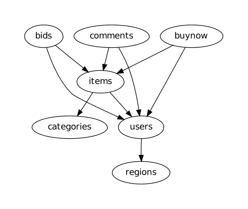

*NoSE is available on [GitHub](https://github.com/michaelmior/NoSE)*

# Abstract

Database design is critical for high performance in relational databases and many tools exist to aid application designers in selecting an appropriate schema. While the problem of schema optimization is also highly relevant for Apache Cassandra, existing tools for relational databases are inadequate for this setting. Application designers wishing to use Cassandra instead rely on rules of thumb to select an appropriate schema. These rules can be challenging to apply without experience because they are often vague or contradictory. NoSE, an automated solution to Cassandra schema design, attempts to avoid these pitfalls.

# Introduction

NoSE is a system for recommending database schemas for Cassandra applications. Our cost-based approach uses a novel integer linear programming formulation to guide the mapping from a simple model of the application workload to a database schema. 

Our prototype is able to implicitly capture rules of thumb used by expert designers without explicitly encoding the rules. Automating the design process allows NoSE to produce efficient schemas and to examine more alternatives than would be possible with a manual rule-based approach.

# Rule-based Schema Design

Many experts in Cassandra data modeling have released [guidelines](http://www.datastax.com/dev/blog/basic-rules-of-cassandra-data-modeling) on how to best design schemas. These guidelines suggest that schemas should be modeled very differently from a relational database and emphasize the importance of relying on knowledge of queries which will be issued by the application.

This results in denormalization and data duplication in order to improve the performance of reads. In common deployment scenarios, writes are inexpensive in Cassandra and this denormalization results in improved performance across the entire application workload. However, when the workload becomes  complex, using a CQL table for each query can result in expensive updates and heavy storage utilization. 

# Automating Schema Design

To avoid the complexity of manually attempting to satisfy the conflicting requirements inherent in rule-based schema design, NoSE attempts to automate this process. This automation consists of three steps:

1. **CQL Table Enumeration**

   The schema design process starts by constructing a set of column families which are useful to answer application queries. These column families are chosen according to a simple model of query execution which uses one or more CQL tables to answer queries in the application.

2. **Query Plan Generation**

   In addition to these column families enumerated in step one, NoSE assumes that some application-side logic may be necessary to answer queries. For example, if a particular CQL table returns data which is sorted incorrectly, the application may need to sort the data after it has been retrieved.

3. **Schema Selection**

   Each of the query plans in step two has an associated cost. We use these costs to construct an integer linear program (ILP) which selects a set of CQL tables to use for the final schema. The ILP implicitly explores all possible combinations of the CQL tables to find the combination which has the lowest cost.

By automating this process, NoSE is able to explore a much larger set of possible designs than a human designer. This allows the generated schema to combine results from multiple tables to answer queries. Moreover, NoSE does also not require the user to have expert knowledge of Cassandra in order to produce a good design. Armed only with a solid knowledge of the application being designed, any user should be able to produce an affective schema.

# Example Use Case

We consider [RUBiS](http://rubis.ow2.org/), a simple version of an online auction website. If we attempt to recreate RUBiS as a Cassandra application, there are several entities and relationships which we must model.

<!--lint disable no-html-->

<!--lint enable no-html-->

There are several queries which the application must answer such as:

* Produce the history of bids for a given item
* Show all comments for a given item
* Browse items within a given category

In addition, the application must support updates including:

* Register a new user
* Place a bid on an item
* Comment on an item

Suppose one application query is to retrieve items in particular category where the end date of the auction has not passed. If items are not heavily modified, NoSE would recommend a CQL table as follows:

    CREATE TABLE items_by_category (
        category_id uuid,
        item_end_date timestamp,
        item_name text,
        item_description text
        PRIMARY KEY((category_id), item_end_date, item_id)
    )

This allows all the items for a given category to be read by a single Cassandra query. NoSE also provides the query to the application developer:

    SELECT item_name, item_description FROM 
    items_by_category WHERE
    category_id = ? AND item_end_date > ?;

The set of CQL tables and queries is provided for each application query provided by the application developer. This makes implementing the application using a Cassandra backend a very straightforward process.
Suppose items are heavily modified or new items are frequently added. In this case, we may want to reduce denormalization of item data. We may already have a CQL table which is used to display item detail pages:

    CREATE TABLE items (
        item_id uuid PRIMARY KEY,
        item_name text,
        item_description text
    )

In this case, we may want to reduce the item data which is stored in the items_by_category table

    CREATE TABLE items_by_category (
        category_id uuid,
        item_end_date timestamp,
        PRIMARY KEY((category_id), item_end_date, item_id)
    )

This table now provides the ID of an item and requires the item data to be fetched from a separate items table. This makes retrieving items by category more expensive, but will make updates to items more efficient.

This example is simple, but demonstrates a tradeoff NoSE is able to make. Across entire workloads, these tradeoffs consider interaction between many different queries. Because the recommendation process completes in seconds, it is also possible for the application designer to explore many different workload parameters. For example, it is easy to adjust the ratio of writes to reads and see how this affects the recommended schema and the performance of each application query.

# Conclusion

Schema design for Cassandra databases is a complex problem with many additional challenges as compared to relational schema design. We have developed a workload-driven approach for schema design which is able to effectively explore various tradeoffs in the design space. For example, NoSE allows applications to explicitly control the tradeoff between normalization and query performance by varying a space constraint. Our approach implicitly captures best practices in Cassandra schema design with relying on general design rules-of-thumb, and is thereby able to generate effective Cassandra schema designs.

# Publications

<!--lint disable no-html-->

  <a href="https://www.researchgate.net/publication/296485511_NoSE_Schema_Design_for_NoSQL_Applications" title="NoSE: Schema Design for NoSQL Applications">
    NoSE: Schema Design for NoSQL Applications
  </a>
  

    Michael J. Mior, Kenneth Salem, Ashraf Aboulnaga, Rui Liu 
    Data Engineering (ICDE), 2016 IEEE 32nd International Conference on
  

  
  <a href="http://dl.acm.org/authorize?N71145" title="Automated schema design for NoSQL databases">
    Automated schema design for NoSQL databases
  </a>

  

    <a href="http://dl.acm.org/author_page.cfm?id=81485657205" >Michael J. Mior</a> 
      SIGMOD'14 PhD Symposium Proceedings of the 2014 SIGMOD PhD symposium,&nbsp;2014
  

<!--lint enable no-html-->
