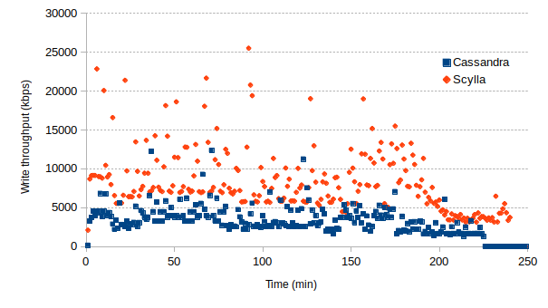
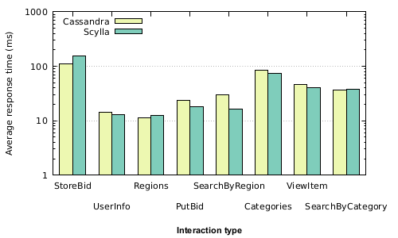

[ScyllaDB](http://www.scylladb.com/) is an alternative to [Apache Cassandra](https://cassandra.apache.org/) which claims to have 10x higher throughput than Cassandra while remaining the same positive properties of scalability and ease of use.
Scylla functions as a drop-in replacement for Cassandra applications using [CQL](https://docs.datastax.com/en/cql/3.1/index.html) (currently with some [disparity in features](http://www.scylladb.com/technology/status/)).
Fortunately, my [past work](/projects/NoSE/) in NoSQL schema design for Cassandra only makes use of features supported by Scylla.

I've been meaning to do my own tests on Scylla for a while, but recently [a faculty member](https://cs.uwaterloo.ca/~jimmylin/) shared about Scylla on our group's Slack channel and suggested I share some results.
I decided to run the same set of experiments I used to evaluate a schema I designed for the [RUBiS](http://rubis.ow2.org/) online auction benchmark.
First, several column families are created and loaded with data.
Next, the different types of transactions in the RUBiS benchmark are executed while measuring the response time.
Before I continue, first a disclaimer that the methodology behind the results is not as rigorous as it could be, but still leaves me skeptical of some of the claims made by Scylla.

These experiments were run using single node installations of Cassandra 3.0.9 and Scylla 1.6.1.
While this is not a typical setup, much of the reasons for performance improvements claimed by Scylla (e.g. lock-free data structures and improved memory management) should still manifest themselves on a single node.
One of the nice things about Scylla is the `scylla_setup` command that attempts to configure the OS for optimal performance including benchmarking the disk storing the data directory.
This configuration was used for both Scylla and Cassandra and otherwise the default settings were used for both systems.

The first striking difference is that the on-disk size of the data for Scylla (9.8 GB) is nearly twice that of Cassandra (5.2 GB).
Despite this, there was not a large difference in load times with Cassandra taking 3 hours 43 minutes and Scylla taking 3 hours 59 minutes.
Below is a graph with the write throughput of the SSD storing the data files in each case.
Scylla seems to push the drive much harder but it's able to keep up.

**Update**: After looking at the number of keys in each table for both Scylla and Cassandra, it seems as though Scylla was storing significantly more data. Repeating the experiment seems to have resolved this issue with no significant impact on performance.

Finally, the results of running the actual benchmark.
RUBiS consists of a number of "interactions" which corresponds to user requests for web pages.
The graph below shows the top eight interactions by frequency and the average response times for both Cassandra and Scylla.
I won't go into a detailed analysis here, but the performance claims made by Scylla don't seem to play out here.

**Update**: A discussion with the CEO of Scylla suggests that Scylla ~~is primarily optimized for throughput and~~ isn't likely to show much improvement in the case of this benchmark which is single-threaded and focused on latency. Rerunning the same experiment concurrently with 10 threads doesn't show significant changes. However, I wasn't measuring the load on the system during these experiments and I can imagine that performance improvements would start to manifest as the system becomes more heavily loaded. Excited to see the continued work of the Scylla team!
